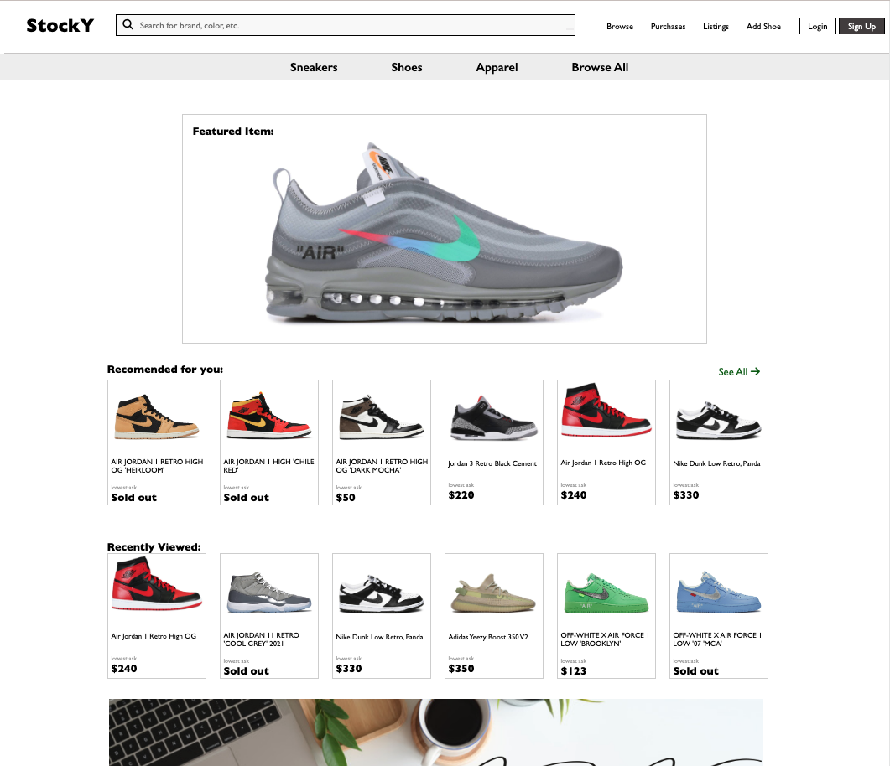

# StockY
 ### [StockY](https://stockx-clone.herokuapp.com/) is a full-stack Stockx Clone that is made the buy and list shoes. 
 
## Frontend technologies used:

 
 
 
 

## Backend technologies used:
   

## How to run app locally
* Run "git clone" with the copy/pasted repo link to own Repository.
* In Root Directory, run `pipenv install -r requirements.txt` to install dependencies.
* Run `pipenv shell`, `flask db init`,  `flask db migrate`, `flask db upgrade`, `flask seed all` (in this order).
* Run ` flask run` to start the backend.
* In a new terminal, cd into the "react-app" directory and run `npm install`
* Then run `npm start` to start the frontend (which will open a browser to localhost:3000)

## WikiLinks
* [Database Schema](https://github.com/jb3k/StockX-CLONE/wiki/Database-Schema)
* [Features](https://github.com/jb3k/StockX-CLONE/wiki/Feature-List)
* [Core User Stories](https://github.com/jb3k/StockX-CLONE/wiki/User-Stories)
* [Wireframes](https://github.com/jb3k/StockX-CLONE/wiki/Wireframes)

# Feature Walkthrough

## Home Page

* Here you can view all of the shoes that are currently in the database. 
* In the top right corner, you will see `Sign Up` and `Login` buttons to officially list or purchase shoes.

## Signup / Login Page

* Here you can create an account or click "Login as Demo User" to be automically logged in as a default user. 

## Shoe Page

* Here you get a clear image of the shoe, along with related products, product detail, historical stats, along with the ability to buy or list shoes for users that are logged in. 

## Buy Shoe Page

* Here you can view the listed shoe and current lowest prices for each size.
* On the second page, you can put in your shipping information to get the shoe delivered. 

Page1

Page2

## Shoe Purchase Page

* Once you purchase a shoe, you will be directed to this page and will be allowed 24 hours to edit your address before the item is shipped and you can no longer edit / delete your purchase order. 

## Sell Shoe Page

* Here you can pick what size shoe you want to list.
* On the second page, you pick what price you want to list your shoe at. 

Page1

Page2

## Shoe Listing Page

* Once you list a shoe, you will be brough to this page to see all of your current listings. 

## Future Plans

* I would like to implement the bonus features on my features list wiki page along with the ability to add shoes into the database. 
